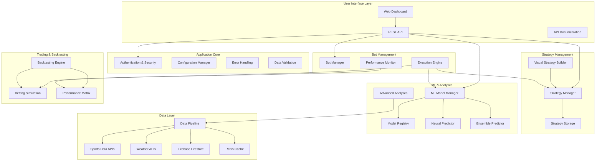
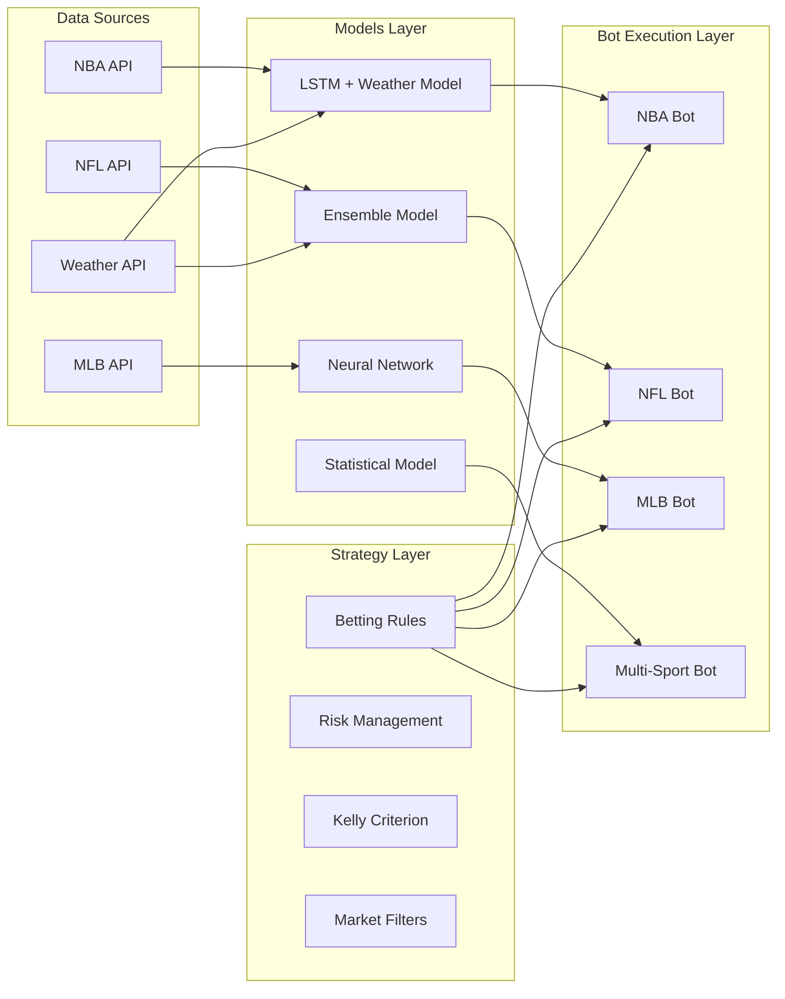
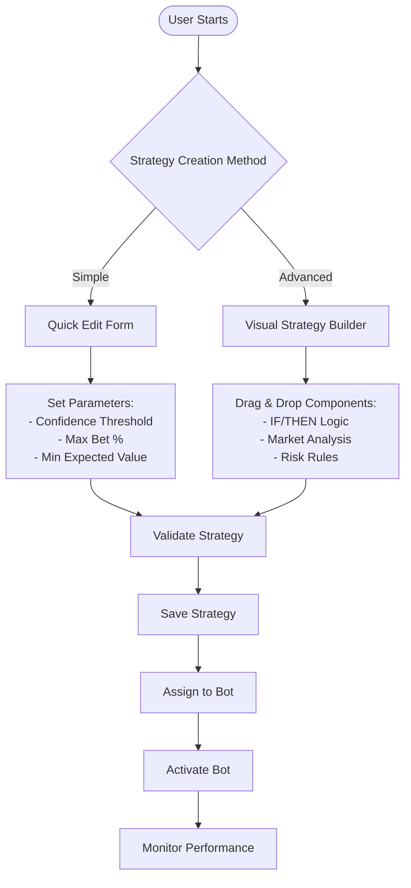
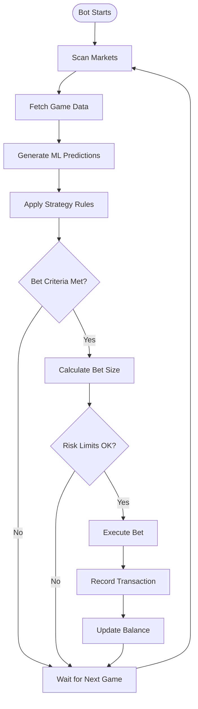
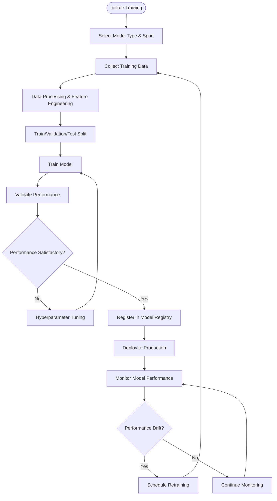
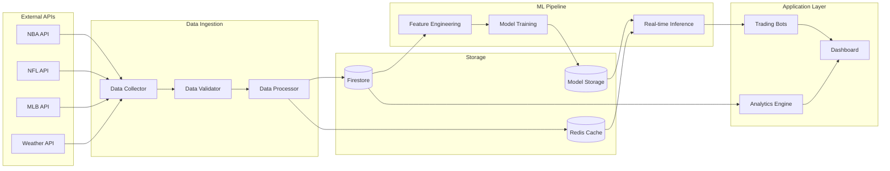
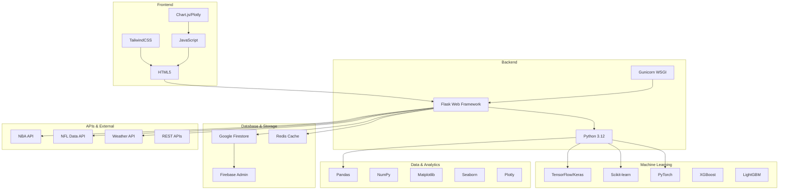
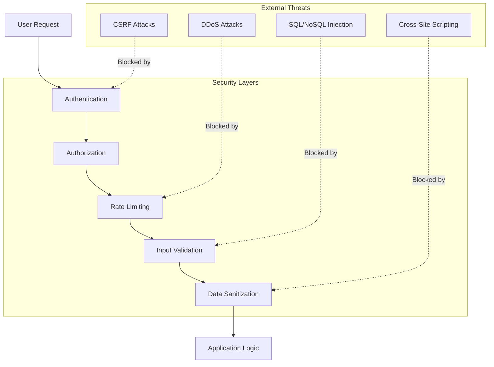
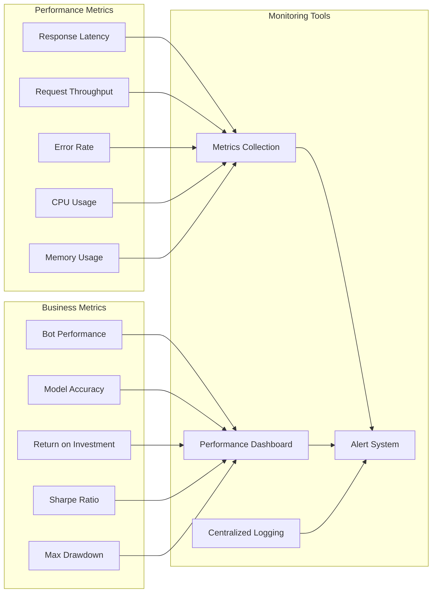
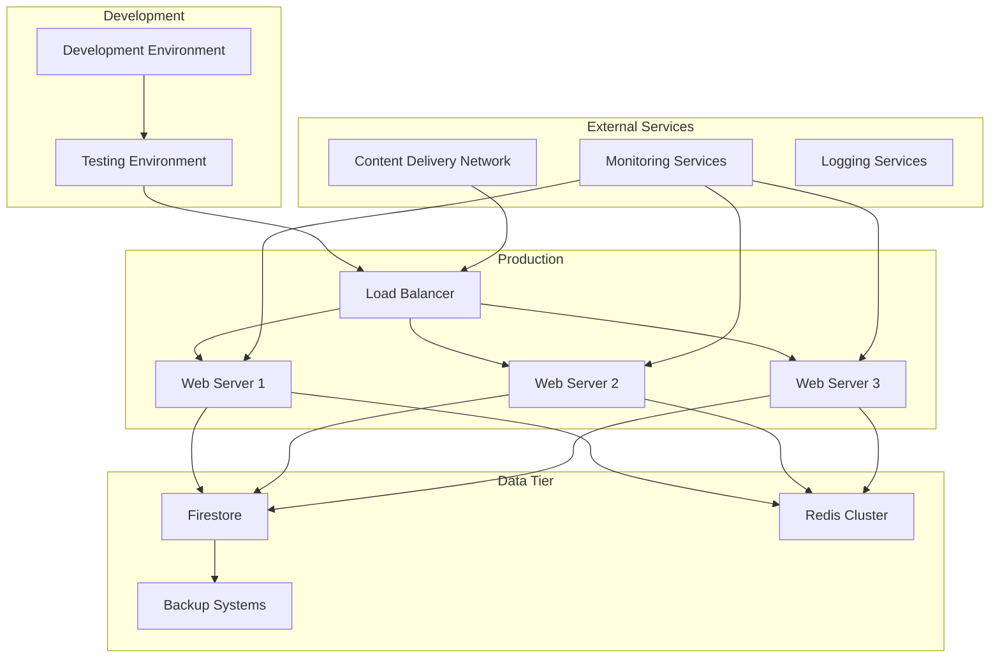

# Post*9 Sports Investment Platform - Architecture & System Design

**MAJOR UPDATE - September 14, 2025**: Enhanced with real model training infrastructure, GPU support, weather integration, and professional data pipeline.

## Overview

Post*9 is a sophisticated sports investment platform that combines advanced machine learning with automated trading strategies. The platform enables users to create, test, and deploy data-driven investment strategies across multiple sports markets.

### 🆕 Recent Infrastructure Enhancements

1. **Real Model Training**: GPU infrastructure with TensorFlow/PyTorch support
2. **Weather API Integration**: OpenWeatherMap integration for LSTM weather models
3. **Professional Data Pipeline**: Modular, toggleable data sources with job processing
4. **Safety-First Investment**: Manual export-place-confirm workflow (live betting disabled)
5. **Real Data Collection**: NBA/NFL API integration with synthetic fallbacks

## Core Concepts Explained

### 🤖 What is a Model?

A **Model** in Post*9 is a machine learning algorithm trained to predict sports outcomes and calculate betting probabilities. Models analyze historical data, team statistics, player performance, and even weather conditions to make intelligent predictions.

**Types of Models:**
- **🆕 LSTM + Weather Models**: Now with real weather API integration for outdoor sports
- **🆕 Ensemble Models**: Enhanced with real training data and GPU acceleration
- **🆕 Neural Network Models**: TensorFlow/PyTorch implementation with actual GPU training
- **Statistical Models**: Traditional statistical approaches using real historical data

**Enhanced Model Capabilities:**
- Real NBA/NFL historical data analysis
- Weather impact modeling for outdoor sports
- GPU-accelerated training with performance metrics
- Real-time model evaluation and comparison
- Professional feature engineering pipeline

### 📋 What is a Strategy?

A **Strategy** in Post*9 defines the logic and rules for making investment decisions. It's the "brain" that decides when, how much, and what type of bets to place based on model predictions and market conditions.

**Strategy Components:**
- **Betting Logic**: Rules for when to place bets (e.g., "bet when confidence > 75%")
- **Risk Management**: Position sizing, bankroll management, maximum bet limits
- **Market Selection**: Which types of bets to focus on (spread, totals, moneyline)
- **Filters**: Conditions that must be met before placing bets
- **Kelly Criterion**: Mathematical optimization for bet sizing

**Strategy Examples:**
- "High Confidence Favorites": Only bet on favorites when model confidence exceeds 80%
- "Value Hunter": Target bets where our predicted probability significantly differs from market odds
- "Weather Edge": Focus on outdoor games where weather gives us an informational advantage

### 🚀 What is a Bot/Automated Investor?

A **Bot** (also called an Automated Investor) is the execution engine that brings everything together. It's an automated system that applies a specific strategy using designated models to make real investment decisions.

**Bot Responsibilities:**
- **Execute Strategies**: Automatically apply strategy rules to live market data
- **Monitor Markets**: Continuously scan for betting opportunities
- **Risk Management**: Enforce position limits and bankroll management
- **Performance Tracking**: Record all decisions and track profitability
- **Model Integration**: Use assigned ML models to generate predictions

**Bot Configuration:**
- Assigned to specific sports (NBA, NFL, MLB, etc.)
- Configured for specific markets (spread, totals, moneyline)
- Linked to one strategy and one or more models
- Given a starting balance and risk parameters
- Set with betting frequency and position size limits

## System Architecture

## Component Architecture

## User Flow Diagrams

### Strategy Creation Flow

### Bot Trading Flow

### Model Training Workflow

## Data Flow Architecture

## Technology Stack

## Security Architecture

## Performance Monitoring

## Deployment Architecture

## Getting Started

### For Developers

1. **Understand the Architecture**: Review the diagrams above to understand how components interact
2. **Set Up Development Environment**: Install dependencies from `requirements.txt`
3. **Explore the Code**: Start with `dashboard/app.py` as the main entry point
4. **Review Models**: Check `dashboard/models/` for ML implementations
5. **Study Strategies**: Look at `dashboard/betting_logic.py` for strategy execution

### For Users

1. **Create Your Strategy**: Use either the Quick Edit form or Visual Strategy Builder
2. **Choose Your Models**: Select appropriate ML models for your target sports
3. **Configure Your Bot**: Set up automated investors with proper risk parameters
4. **Monitor Performance**: Use the dashboard to track your bot's trading performance
5. **Iterate and Improve**: Analyze results and refine your strategies

## Key Files and Directories

- `dashboard/app.py` - Main Flask application
- `dashboard/models/` - ML model implementations
- `dashboard/betting_logic.py` - Strategy execution logic
- `dashboard/analytics/` - Advanced analytics and statistics
- `dashboard/ml/` - Machine learning management
- `dashboard/templates/` - Web interface templates
- `dashboard/static/` - CSS, JavaScript, and assets

## Contributing

When contributing to Post*9, please follow these guidelines:

1. Understand the component you're working on using the architecture diagrams
2. Ensure changes don't break the model → strategy → bot workflow
3. Add appropriate tests for new functionality
4. Update documentation when adding new features
5. Follow the existing code style and patterns

---

**Last Updated**: 9/13/2025