# Post*9 Quick Reference Guide

## 🚀 Quick Start

### 1. Understanding the Basics


**Simple Formula**: `Data → Model → Strategy → Bot → Profit`

### 2. Core Concepts in 30 Seconds

| Component | What It Does | Example |
|-----------|--------------|---------|
| **Model** 🤖 | Predicts game outcomes using AI | "Lakers have 75% win probability" |
| **Strategy** 📋 | Rules for when/how to bet | "Only bet when confidence > 80%" |
| **Bot** 🚀 | Executes trades automatically | "Place $100 bet on Lakers moneyline" |

## 📊 Model Types Quick Guide

```mermaid
graph LR
    subgraph "Model Types"
        LSTM[LSTM + Weather<br/>🌦️ Outdoor Sports]
        ENS[Ensemble<br/>🎯 Multiple Algorithms]
        NN[Neural Network<br/>🧠 Deep Learning]
        STAT[Statistical<br/>📈 Traditional Stats]
    end
    
    NBA[NBA] --> ENS
    NFL[NFL] --> LSTM
    MLB[MLB] --> LSTM
    NCAAB[NCAAB] --> NN
    NCAAF[NCAAF] --> LSTM
```



### When to Use Each Model:

- **LSTM + Weather**: Outdoor sports (NFL, MLB, NCAAF) where weather matters
- **Ensemble**: High-frequency indoor sports (NBA, NCAAB) with lots of data
- **Neural Network**: Complex pattern recognition across all sports
- **Statistical**: Simple, interpretable models for beginners

## 🎯 Strategy Templates

### Conservative Strategy
```
Confidence Threshold: 85%
Max Bet Percentage: 2%
Risk Level: Low
Expected Return: 8-12% annually
```

### Aggressive Strategy
```
Confidence Threshold: 65%
Max Bet Percentage: 5%
Risk Level: High
Expected Return: 20-30% annually
```

### Value Hunter Strategy
```
Min Expected Value: 15%
Kelly Criterion: 0.5
Focus: Market inefficiencies
Expected Return: Variable, high potential
```

## 🤖 Bot Configuration Cheat Sheet


### Essential Settings:
- **Starting Balance**: How much money the bot can use
- **Max Bet %**: Maximum percentage of balance per bet (typically 1-5%)
- **Stop Loss**: Automatic shutdown if losses exceed threshold
- **Daily Limits**: Maximum number of bets per day

## 📈 Performance Metrics

| Metric | Good | Excellent | What It Means |
|--------|------|-----------|---------------|
| **Win Rate** | >52% | >58% | Percentage of winning bets |
| **ROI** | >5% | >15% | Return on investment |
| **Sharpe Ratio** | >1.0 | >2.0 | Risk-adjusted returns |
| **Max Drawdown** | <20% | <10% | Largest losing streak |

## 🔧 Common Workflows

### Creating Your First Bot

1. **Navigate to Dashboard** → Bots Section
2. **Click "Create New Bot"**
3. **Select Sport**: Start with NBA (most data available)
4. **Choose Model**: Ensemble for beginners
5. **Pick Strategy**: Use "Conservative" template
6. **Set Balance**: Start with small amount ($1000)
7. **Configure Limits**: 2% max bet, 10% stop loss
8. **Activate and Monitor**

### Improving Performance


### Troubleshooting Common Issues

| Problem | Likely Cause | Solution |
|---------|--------------|----------|
| Bot not placing bets | Confidence threshold too high | Lower threshold to 60-70% |
| Too many losing bets | Model needs retraining | Update with recent data |
| High volatility | Bet sizes too large | Reduce max bet percentage |
| Missing opportunities | Strategy too restrictive | Broaden market filters |

## 📚 File Structure Quick Reference

```
SI-HQ/
├── dashboard/
│   ├── app.py                 # Main Flask application
│   ├── models/                # ML model implementations
│   │   ├── neural_predictor.py    # Neural networks
│   │   └── ensemble_predictor.py  # Ensemble models
│   ├── betting_logic.py       # Strategy execution
│   ├── ml/                    # ML management
│   │   └── model_manager.py   # Model lifecycle
│   └── templates/             # Web interface
├── ARCHITECTURE_AND_SYSTEM_DESIGN.md  # Full documentation
└── requirements.txt           # Python dependencies
```

## 🚨 Best Practices

### Do's ✅
- Start with small amounts while learning
- Use backtesting before live trading
- Monitor performance daily
- Keep detailed logs
- Diversify across multiple sports/strategies
- Update models regularly with fresh data

### Don'ts ❌
- Risk more than you can afford to lose
- Overtrain models on small datasets
- Ignore risk management rules
- Chase losses with bigger bets
- Use the same strategy for all sports
- Deploy without proper testing

## 🆘 Quick Troubleshooting

### Installation Issues
```bash
# Install dependencies
pip install -r requirements.txt

# Run basic tests
python /tmp/test_mermaid_syntax.py
```

### Model Training Fails
1. Check data availability for chosen sport
2. Reduce training sample size
3. Try simpler model type (Statistical)
4. Verify sufficient historical data

### Bot Not Trading
1. Check confidence threshold (should be 50-80%)
2. Verify sufficient balance
3. Ensure strategy rules aren't too restrictive
4. Check if markets are active

## 📞 Getting Help

1. **Check Logs**: Dashboard → Performance → Bot Logs
2. **Review Documentation**: `ARCHITECTURE_AND_SYSTEM_DESIGN.md`
3. **Analyze Performance**: Use built-in analytics dashboard
4. **Test Changes**: Always use backtesting first

## 🎯 Success Metrics

Track these KPIs weekly:
- **Consistency**: Steady returns without major swings
- **Risk Management**: Staying within defined limits
- **Model Performance**: Prediction accuracy trends
- **Strategy Effectiveness**: Win rate and profitability

Remember: **Sports investing is a marathon, not a sprint!** 🏃‍♂️

---

*For detailed technical information, see [ARCHITECTURE_AND_SYSTEM_DESIGN.md](ARCHITECTURE_AND_SYSTEM_DESIGN.md)*

---

**Last Updated**: 9/13/2025